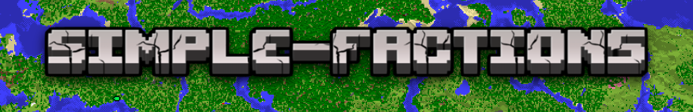

  

  <a href="#description">Description</a> •
  <a href="#features">Features</a> •
  <a href="#requirements">Requirements</a> •
  <a href="#installation">Installation</a> •
  <a href="#configuration">Configuration</a> •
  <a href="#commands">Commands</a> •
  <a href="#permissions">Permissions</a> •
  <a href="#developer-api">Developer API</a>

<h2 id="description">📝 Description</h2>

**Simple Factions** is a Minecraft factions plugin that adds factions, also known as guilds or teams, to your server. It's built around one goal: keeping it simple.

No complicated setup, difficult commands, confusing interfaces, or unnecessary features. Simple Factions focuses on the core functionality you'd expect from a factions plugin while keeping everything easy to understand and use.

It's designed to be lightweight and accessible for both players and server owners. No configuration is required to get started simply install the plugin, start your server, and begin creating factions.

<h2 id="features">⚡ Features</h2>

* **No configuration required:** Install the plugin and start using it immediately. Configuration is available if you want to customize your server.
* **Faction management:** Create, delete, modify, and manage factions with simple commands.
* **User-friendly GUI:** Manage your faction through an intuitive graphical interface.
* **Custom chat:** Switch between public chat and faction-only chat.
* **Admin interface:** Monitor and manage factions across your server.
* **Faction name blacklist:** Prevent players from using unwanted or reserved faction names.
* **Developer API:** A simple and flexible API for building integrations and custom features.
* **Lightweight:** Focuses on the essentials without unnecessary complexity.

<h2 id="installation">🚀 Installation</h2>

1. Create a **Paper** server if you don't already have one: [PaperMC Getting Started](https://docs.papermc.io/paper/getting-started/)
2. Download the latest version of **Simple Factions** from [Modrinth](https://modrinth.com/plugin/simple-factions/versions).
3. Place the downloaded `.jar` file into your server's `plugins` folder.
4. Start or restart your server.
5. That's it! Simple Factions is ready to use.

<h2 id="configuration">⚙️ Configuration</h2>

Simple Factions works out of the box, but several settings can be customized to fit your server.

### Configuration File

The main configuration file is `config.yml`, located in the Simple Factions plugin folder.

1. Open `config.yml`.
2. Find the setting you want to change and edit its value.
3. Save the file.
4. Run `/f reload` in-game or from the console to apply the changes.

### Settings

| Setting                         | Description                                              |
| ------------------------------- | -------------------------------------------------------- |
| `max-members-per-faction`       | Sets the maximum number of members allowed in a faction. |
| `enable-faction-name-blacklist` | Enables or disables the faction name blacklist.          |

### Faction Name Blacklist

The faction name blacklist prevents players from using specific names for their factions.

To edit the blacklist:

1. Open `blacklist.yml` in the Simple Factions plugin folder.
2. Add a new name on a new line, or remove an existing name.
3. Save the file.
4. Run `/f reload` in-game or from the console.

<h2 id="commands">💬 Commands</h2>

### User Commands

| Command                                 | Description                                            |
| --------------------------------------- | ------------------------------------------------------ |
| `/f`                                    | Opens the Simple Factions GUI.                         |
| `/f help`                               | Shows all available commands and their descriptions.   |
| `/f <command> help`                     | Shows the description and usage of a specific command. |
| `/f create`                             | Creates a new faction.                                 |
| `/f delete`                             | Deletes your faction.                                  |
| `/f leave`                              | Leaves your current faction.                           |
| `/f list`                               | Lists all existing factions.                           |
| `/f members <FactionName>`              | Lists the members of a faction.                        |
| `/f info <FactionName>`                 | Shows information about a faction.                     |
| `/f invite <PlayerName>`                | Invites a player to your faction.                      |
| `/f request <FactionName>`              | Requests to join a faction.                            |
| `/f accept <PlayerName / FactionName>`  | Accepts an invitation or join request.                 |
| `/f decline <PlayerName / FactionName>` | Declines an invitation or join request.                |
| `/f kick <PlayerName>`                  | Kicks a member from your faction.                      |
| `/f chat <public/faction>`              | Sets your default chat mode to public or faction chat. |
| `/f modify name <FactionName>`          | Changes your faction's name.                           |
| `/f modify color <FactionColor>`        | Changes your faction's color.                          |
| `/f modify owner <PlayerName>`          | Transfers ownership of your faction.                   |

<h2 id="developer-api">🛠️ Developer API</h2>

Simple Factions provides a developer API for creating custom integrations and features.

The API allows other plugins to interact with Simple Factions without needing to directly access its internal implementation.

For API documentation and examples, see [API Documentation](). For any questions about the API you can always contact us in the [Discord server](https://discord.com/invite/AwA7mXV8qba).

<h2 id="support">💬 Support</h2>

Need help, found a bug, or have a suggestion?

Join the **[Simple Factions Discord](https://discord.com/invite/AwA7mXV8qba)** to ask questions, report issues, and discuss the plugin with the community.

<h2 id="license">📄 License</h2>

Simple Factions is licensed under the **GNU General Public License v3.0**.

See the [GPL-3.0 license](https://www.gnu.org/licenses/gpl-3.0) for more information.
